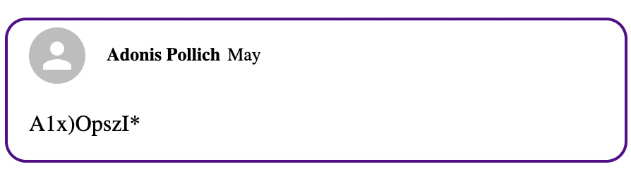
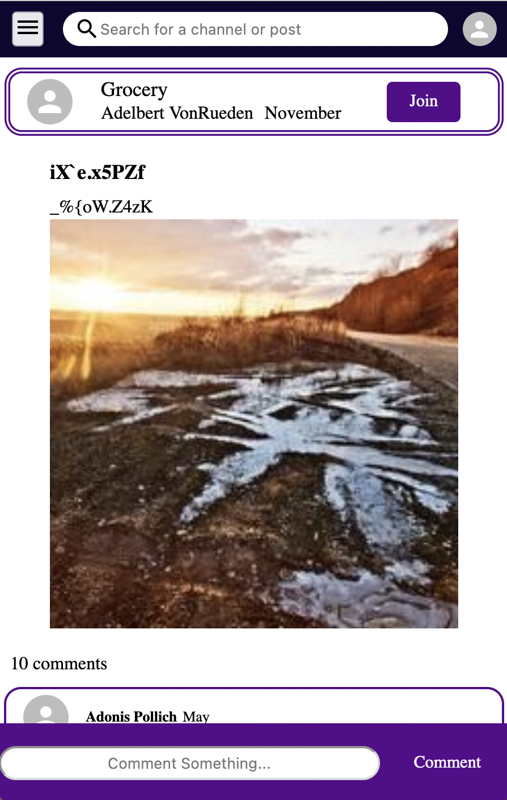
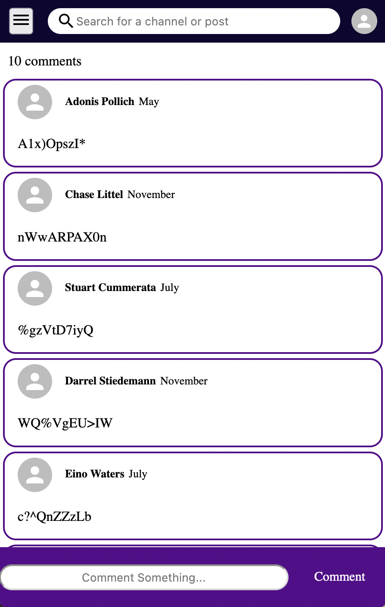
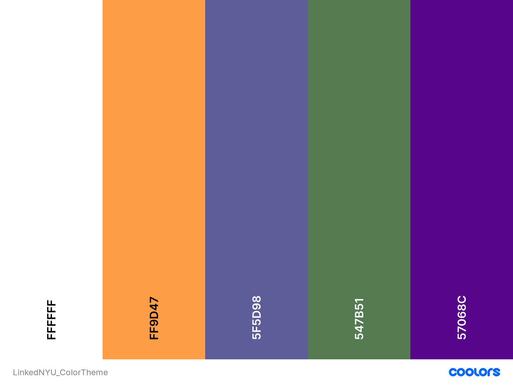

# LinkedNYU

This will be the primary repo where development of LinkedNYU takes place. 

- [LinkedNYU](#linkednyu)
	- [Product Vision](#product-vision)
	- [Description](#description)
	- [Team Members](#team-members)
	- [Sprint Planning](#sprint-planning)
		- [Sprint 0](#sprint-0)
		- [Sprint 1](#sprint-1)
		- [Sprint 2](#sprint-2)
	- [Front-end](#front-end)
		- [Components](#components)
		- [Pages](#pages)
		- [Color Theme](#color-theme)
	- [Contributing](#contributing)

## Product Vision

Providing fast and convenient experience for NYU student to directly get access to course sources and solve their confusions.     

## Description

LinkedNYU provides a platform for students from the same course to find their classmates, discuss with each other and socialize. Previous students from this course can share their experience and help others decide whether to take this course or not. 

In order to provide most convenient and satisfying experience for NYU students, LinkedNYU is supposed to contain following basic functions:

- Viewing:

	Students can view other's posts and comment. 

	Logged in students can see new updates in the channels they joinned. 

- Searching: 

	Powerful searching tools that will enable students to find their courses based on the course number, name, name of Professor;

	Searching function will present student with relative channels and posts.

	Students can join course channel to keep updated.

- Posting:

	Students can post discussions in their channels. 

	Posts will be shared to other students, who can also join the discussion by commenting their own thoughts.

## Team Members

[@Comf0rTS1997](https://github.com/Comf0rTS1997)    
[@AnastasiaYe](https://github.com/AnastasiaYe)        
[@princeampofo](https://github.com/princeampofo)     
[@Willis1118](https://github.com/Willis1118)   
[@Azanah](https://github.com/azanah)

## Sprint Planning
### Sprint 0
Product Owner [@Willis1118](https://github.com/Willis1118)       
Scrum Master [@AnastasiaYe](https://github.com/AnastasiaYe)  
### Sprint 1
Product Owner [@Willis1118](https://github.com/Willis1118)       
Scrum Master [@AnastasiaYe](https://github.com/AnastasiaYe)  
### Sprint 2
Product Owner [@princeampofo](https://github.com/princeampofo)  
Srum Master [@Comf0rTS1997](https://github.com/Comf0rTS1997)  

## Front-end
We use `react.js` for front-end developemnt.    
Before implementing back-end, data's are fetching from mock datas. We use [MockAPI](https://mockapi.io/) instead of Mockaroo, as the latter one has a daily request limit. Images are radomly generated from [PicSum](https://picsum.photos/).     
During the development, we divded front-end elements into components and pages:
### Components
1. Avatar
2. Button [@AnastasiaYe](https://github.com/AnastasiaYe)   
       
	We use a uniform button design for all button components. It takes `children`(the text of the button), `type`, `onClick`(onClick function), `buttonStyle` and `buttonSize` as inputs.    
	Two styles and three sizes are designed for developers to choose. New style and size can be customized by changing the `css`.  
3. Comment [@AnastasiaYe](https://github.com/AnastasiaYe)   
	    
   Comments appear as little boxes displayed as `css flex box`. Each comment cotains information of `avatar`, `name`, `date`, `comment content`. 
4. PostBox
5. TextBox
6. Hamburger Menu
7. Header
### Pages
1. Home Page
2. Account Page
3. Channel Page
4. Detailed Post Page [@AnastasiaYe](https://github.com/AnastasiaYe)  
            
   Detailed Post Page is what user will see after clicking into a post. Information on this page includes `post title`, `post content`, `poster avatar`, `poster name`, `post date`, `course channel` and `post image`.    
   Additionally, `cooments` on this post along with the `comment count` are also displayed below the post.    
   Finally, there's a footer at the bottom of this page, where users can type in new comment. 
5. Join Class Page
6. Create New Post Page
7. Log In Page
### Color Theme
We choose NYU purple to be the main color of our theme.     

## Contributing

Anyone is welcome to dive in! Feel free to Open an issue or Pull Request. 

In terms of more detailed contributing rule, read through 
[CONTRIBUTING.md](https://github.com/software-students-fall2021/project-setup-linkednyu/blob/master/CONTRIBUTING.md).

